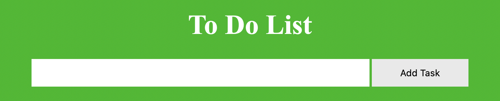
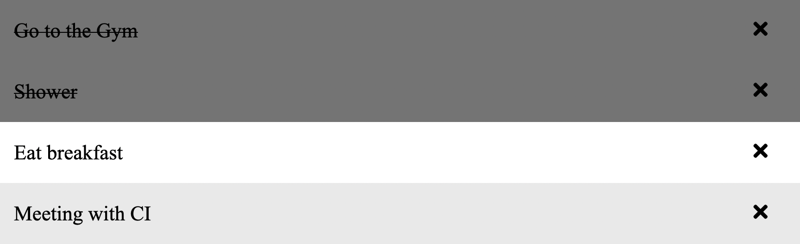
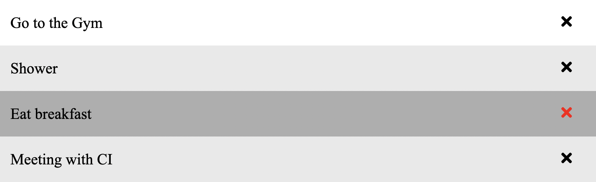
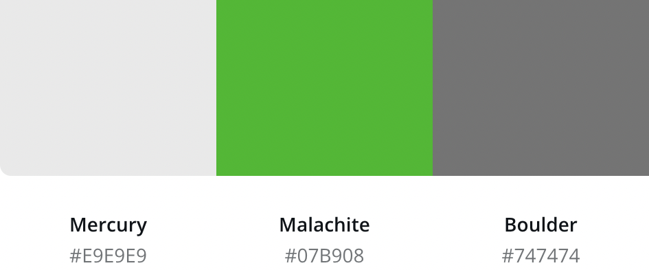

# To Do List

The main goal with this site is to help people organize their day to day life. 
This site will target people that have alot of things to get done on a daily basis and need a way to keep track of their tasks.
The site will help users to set up daily tasks/goals and keep track of whats been done and what needs to get done.

## Features

-  __The Add Task Feature__

    - Featured on the top of the page, this feature allows users to input their own tasks that need to get done and then add it to a list by pressing the "Add" button.

    

- __The Check Feature__

    - Each task allow the users to click on it to add or remove a class. The class thats added checks the task of by changing its background color and adds a line through the task to make it clear that the task is completed.

    

- __The Remove Task Feature__
    
    - To the right of all tasks is a times symbol that allows users to click on it to remove the task incase they dont want to just check it of.

    

## Feature Left To Implement

- __Save Users Task__
    - Once i've learned more and start to understand more about JavaScript i would love to add a feature that saves and stores the users tasks. This would make it possible for users to acces their tasks on any device without having to keep the site open at all times for it to not reset.

## Color Scheme

Since the goal is to have users use the site during the morning hours i wanted to have clean and relaxing colors witch is why i used theese three colors for most of the project.

## Testing

I've checked so the site works on diffrent browsers like Google Chrome, Firefox and Safari. I've also checked so the site works on diffrent screen sizes lite an Iphone and Ipad.

### Validator Testing 

- HTML
    - No errors were returned when passing through the official [W3C validator](https://validator.w3.org/nu/?doc=https%3A%2F%2Fcode-institute-org.github.io%2Flove-maths%2F)
- CSS
    - No errors were found when passing through the official [(Jigsaw) validator](https://jigsaw.w3.org/css-validator/validator?uri=https%3A%2F%2Fvalidator.w3.org%2Fnu%2F%3Fdoc%3Dhttps%253A%252F%252Fcode-institute-org.github.io%252Flove-maths%252F&profile=css3svg&usermedium=all&warning=1&vextwarning=&lang=en)
- JavaScript
    - When passing the JavaScript code through the official site [Jshint validator](https://jshint.com/) i found one warning witch was the following : Functions declared within loops referencing an outer scoped variable may lead to confusing semantics. (closeTask, i). I fixed this by
      - The following metrics were returned: 
      - There are 6 functions in this file.
      - Function with the largest signature take 1 arguments, while the median is 0.
      - Largest function has 9 statements in it, while the median is 3.5.
      - The most complex function has a cyclomatic complexity value of 4 while the median is 2.